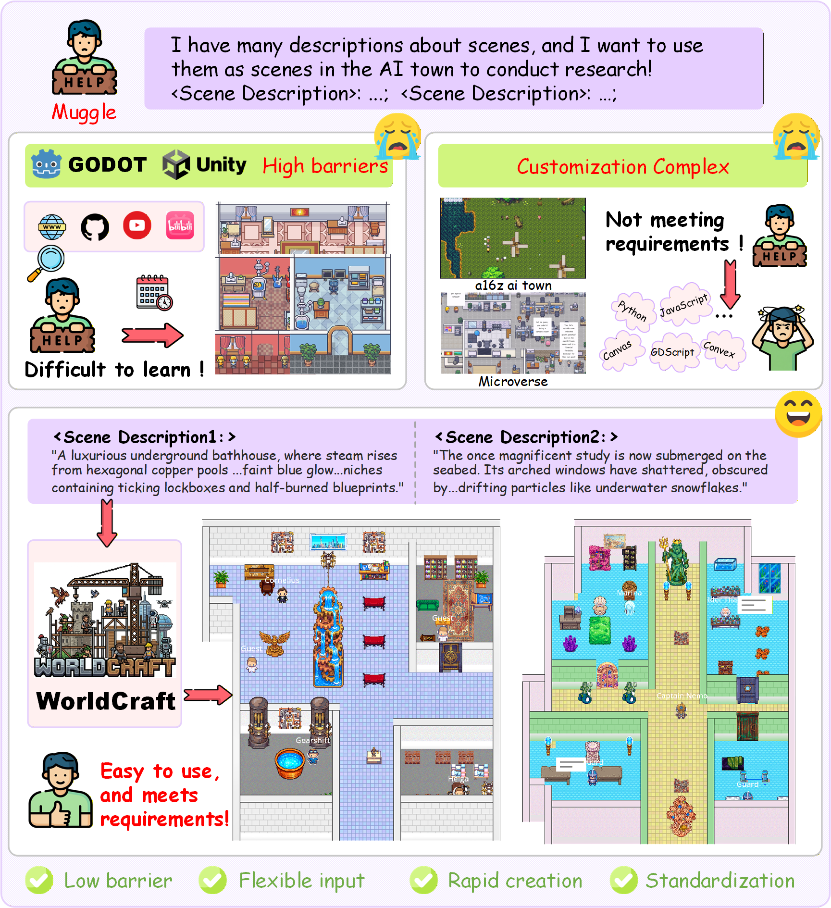
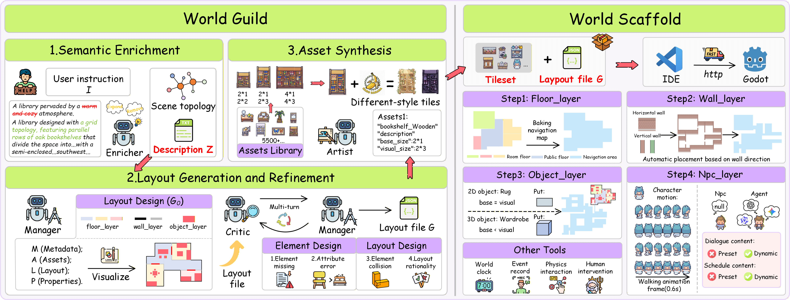

## World Craft: Agentic Framework to Create Visualizable Worlds via Text

Jianwen Sun $^{1,2,3*}$, Yukang Feng $^{1,2*}$, Kaining Ying $^{4*}$, Chuanhao Li $^{7}$

Zizhen Li $^{1,2,3}$ , Fanrui Zhang $^{6,2}$ , Jiaxin Ai $^{4,2}$ , Yifan Chang $^{6,2}$ , 

Yu Dai $^{3}$ , Yifei Huang $^{1}$ , Kaipeng Zhang $^{1,2\dagger}$

<small>

$^1$ Shanda AI Research, Tokyo &nbsp; $^2$ Shanghai Innovation Institute &nbsp; $^3$ Nankai University 

$^4$ Fudan University &nbsp; $^5$ Wuhan University &nbsp; $^6$ USTC &nbsp; $^7$ Shanghai AI Laboratory
</small>

<!-- Teaser Section -->

<b>Generated World View</b>

<!-- Video Link Section -->

<b>Agent Simulation Demo</b>

World Craft is an agentic world creation framework designed to democratize the creation of executable and visualizable AI simulations (e.g., AI Town). By leveraging Large Language Models (LLMs), World Craft allows users to create complex, dynamic game scenes simply through textual descriptions, without requiring any programming expertise.

### 🌟 Overview
Large Language Models (LLMs) have opened new possibilities for generative agent simulations. However, customizing a visualizable environment usually requires expert knowledge in coding and game engines.World Craft bridges this gap with two core modules:World Scaffold: A structured and concise standardization for developing interactive game scenes, serving as an efficient scaffolding for LLMs to build executable environments.World Guild: A multi-agent framework that progressively analyzes user intents from rough descriptions and synthesizes structured content (e.g., environment layout and assets) for the World Scaffold.(Note: Please replace assets/overview.png with your actual framework architecture diagram)Key FeaturesZero-Code Creation: Create "AI Town" style worlds using only natural language.Multi-Agent Guild: A collaborative agent system that handles narrative intent, layout generation, and asset synthesis.Spatial Error Correction: Incorporates a high-quality error-correction mechanism via reverse engineering to ensure logical and controllable layouts.Superior Performance: Outperforms commercial coding agents (Cursor, Antigravity) and state-of-the-art LLMs (Qwen3, Gemini-3-Pro) in scene construction and narrative intent conveyance, providing a scalable solution for the democratization of environment creation. 

## 🏗️ Framework Architecture
1. World ScaffoldWorld Scaffold acts as the "skeleton" of the simulation. It translates abstract requirements into a standardized format that game engines can execute. It defines the rules for interaction, boundaries, and object placement.
2. World GuildThe World Guild is the "brain" of the creation process. It consists of specialized agents:Intent Analyst: Parses rough user descriptions.Layout Architect: Designs the spatial arrangement.Asset Synthesizer: Selects and places appropriate assets.

<table>
<tr>
<td align="center">

<b>World Craft Framework</b>
</td>
</tr>
</table>

## 🎨 Assets & Acknowledgments
The visual assets (tile sets and objects) demonstrated in World Craft are primarily sourced from the Modern Series created by the talented pixel artist LimeZu on itch.io.

License & Usage: We utilize these assets under the Complete Version License (Commercial/Non-commercial use permitted). We strictly adhere to the original license terms:

✅ Permitted: Using and editing assets for the project.

🚫 Prohibited: Reselling or redistributing the raw assets.

A Special Note: We extend our sincere gratitude to LimeZu for providing such high-quality and consistent artistic resources to the community. The "Modern" series provides an excellent foundation for AI simulation environments.

We strongly encourage all users and researchers to visit LimeZu's page and purchase/support their work. Your support helps sustain the creation of amazing open-source game assets.

📢 Coming Soon: We plan to open-source the data processing scripts and annotation code that we developed based on this asset library, helping researchers easily integrate these high-quality assets into their own AI pipelines.

## 📝 Citation
If you find this project useful in your research, please consider citing:

    @misc{sun2026worldcraftagenticframework,
        title={World Craft: Agentic Framework to Create Visualizable Worlds via Text}, 
        author={Jianwen Sun and Yukang Feng and Kaining Ying and Chuanhao Li and Zizhen Li and Fanrui Zhang and Jiaxin Ai and Yifan Chang and Yu Dai and Yifei Huang and Kaipeng Zhang},
        year={2026},
        eprint={2601.09150},
        archivePrefix={arXiv},
        primaryClass={cs.HC},
        url={https://arxiv.org/abs/2601.09150}, 
    }

## 👥 Authors & Affiliations

* Equal contribution. $^\dagger$ Corresponding author.</small>
